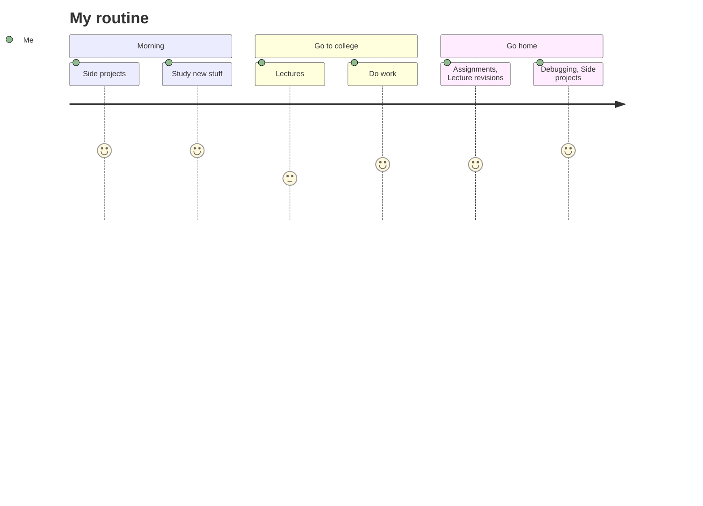

<!--
**iMuhammadwaseem/iMuhammadwaseem** is a ✨ _special_ ✨ repository because its `README.md` (this file) appears on your GitHub profile.

Here are some ideas to get you started:

- 🔭 I’m currently working on ...
- 🌱 I’m currently learning ...
- 👯 I’m looking to collaborate on ...
- 🤔 I’m looking for help with ...
- 💬 Ask me about ...
- 📫 How to reach me: ...
- 😄 Pronouns: ...
- ⚡ Fun fact: ...
-->

##   I am an Undergraduate Student
<!--
- 📚 I’m currently learning everything related to tech
- 🥅 2022 Goals: Contribute to Open Source projects
- 🤐 Fond of Apple Products 💻 

 

-->

## Feel free to Connect ✌

[][linkedin]
<!-- [][instagram]

[instagram]: https://instagram.com/imuhammadwaseem17 -->
[linkedin]: https://linkedin.com/in/imuhammadwaseem
